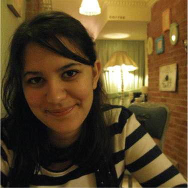
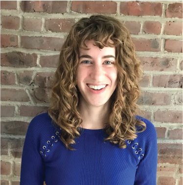

## Contact
#### If you have any questions about SCOT, please feel free to e-mail us: 

| |||
| [Ritambhara Singh, Ph.D.](https://ritambharasingh.com/) (Principal Investigator)|[Pinar Demetci](pinardemetci.github.io) (Project co-lead)|[[Rebecca Santorella](https://sites.google.com/brown.edu/rebecca-santorella/) (Project co-lead)|
|ritambhara@brown.edu](mailto:ritambhara@brown.edu)|[pinar_demetci@brown.edu](mailto:pinar_demetci@brown.edu)|[rebecca_santorella@brown.edu](mailto:rebecca_santorella@brown.edu)|

##### We would also like to acknowledge our collaborators and co-authors: 

| ||
| [Björn Sandstede, Ph.D.](http://bjornsandstede.com/)|[William Stafford Noble, Ph.D.](https://noble.gs.washington.edu/~wnoble/) 
|Brown University | University of Washington

#### If you have any questions about SCOT, please feel free to e-mail us: 

[Ritambhara Singh, Ph.D.](https://ritambharasingh.com/) (Principal Investigator) -- [ritambhara@brown.edu](mailto:ritambhara@brown.edu)  
[Pinar Demetci](pinardemetci.github.io) (Project co-lead) -- [pinar_demetci@brown.edu](mailto:pinar_demetci@brown.edu) 
[Rebecca Santorella](https://sites.google.com/brown.edu/rebecca-santorella/) (Project co-lead) -- [rebecca_santorella@brown.edu](mailto:rebecca_santorella@brown.edu) 

If you run into an issue with the source code, you can also [create an issue on our GitHub page](https://github.com/rsinghlab/SCOT/issues) and we will look into it as soon as possible. 

##### We would also like to acknowledge our collaborators and co-authors: 

[Björn Sandstede, Ph.D.](http://bjornsandstede.com/) (Brown University)  
[William Stafford Noble, Ph.D.](https://noble.gs.washington.edu/~wnoble/) (University of Washington)