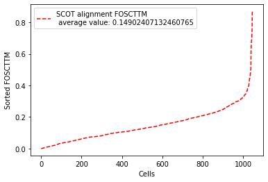
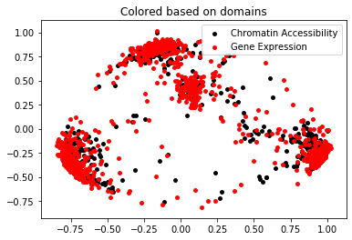

**Note:** This GitHub page is a work in progress. It will contain information on the SCOT methodology, as well as demonstrated examples in various application cases.  

### Overview
SCOT is an unsupervised algorithm for cell-to-cell alignment of single-cell multi-omic data. <br>
For many single-cell technologies, it is difficult to apply them simultaneously on the same single-cell. As a result, to get multiple views of a genome at the single-cell resolution, we need to integrate data from different -omic sequencing datasets. When these single-cell sequencing methods are applied to the same cell population or different populations that are expected to share some underlying biological manifold (e.g. common cell types), we expect there to be some cell-to-cell alignment to recover. SCOT performs alignment by using Gromov-Wasserstein optimal transport.  

<br> 
SCOT works in three steps:  
**1.** It first checks pairwise correlations between samples in each sequencing dataset and constructs k nearest-neighbor graphs for each to computing intra-domain distances while accounting for local geometry.  
**2.** It then optimizes the Gromov-Wasserstein optimal transport formulation to look for a probabilistic sample-wise correspondence matrix between the input datasets.  
**3.** Using this coupling matrix, it projects one dataset onto the other one using barycentric projection.  

For more details, check out our [pre-print on bioRxiv](https://www.biorxiv.org/content/10.1101/2020.04.28.066787v2.full)


## Example: Replicating SCOT alignment results on SNARE-seq Cell Mixture Data

**Access to the raw dataset:** Gene Expression Omnibus accession no. GSE126074. 
SNARE-seq data in `/data` folder containes the version with dimensionality reduction techniques applied from [the original SNARE-seq paper](https://www.nature.com/articles/s41587-019-0290-0) (https://www.nature.com/articles/s41587-019-0290-0).

In this dataset, we have 1047 cells, simultaneously sequenced for their gene expression and chromatin accessibility profiles. Originally, the two domains (gene expression and chromatin accessibility) live in different spaces but we align them in the same space in an unsupervised fashion (by finding probabilistic correspondences between samples from each domain and projecting one onto the other), and use the groundtruth on correspondences to assess alignment quality.   


If you have any questions, e-mail: pinar_demetci@brown.edu, rebecca_santorella@brown.edu, ritambhara@brown.edu  

### Read in the data


```python
import sys
sys.path.insert(1, '../src/')
import utils as ut
import evals as evals
import scot as scot
import numpy as np
```


```python
# Loading the datasets (version pre-processed according to the original publication of the data)
X=np.load("../data/scatac_feat.npy") 
y=np.load("../data/scrna_feat.npy")
print("Dimensions of input datasets are:\n", "X (chromatin accessibility)= ", X.shape, "\n y (gene expression) = ", y.shape)
```

    Dimensions of input datasets are:
     X (chromatin accessibility)=  (1047, 19) 
     y (gene expression) =  (1047, 10)


### Perform alignment with SCOT


```python
# Initialize SCOT object
scot=scot.SCOT(X, y)
# Call the alignment with l2 normalization 
X_new, y_new = scot.align(k=50, e=0.0005,  normalize=True)
```

    It.  |Err         
    -------------------
        0|2.152968e-03|
       10|6.118185e-04|
       20|8.246992e-05|
       30|3.894956e-05|
       40|3.216470e-05|
       50|3.068255e-05|
       60|2.850152e-05|
       70|2.484922e-05|
       80|2.042939e-05|
       90|1.618798e-05|
      100|1.259759e-05|
      110|9.709774e-06|
      120|7.426016e-06|
      130|5.636091e-06|
      140|4.246817e-06|
      150|3.179940e-06|
      160|2.368862e-06|
      170|1.757536e-06|
      180|1.299939e-06|
      190|9.592410e-07|
    It.  |Err         
    -------------------
      200|7.066033e-07|
      210|5.198315e-07|
      220|3.820633e-07|
      230|2.806101e-07|
      240|2.059904e-07|
      250|1.511563e-07|
      260|1.108881e-07|
      270|8.133075e-08|
      280|5.964305e-08|
      290|4.373381e-08|
      300|3.206565e-08|
      310|2.350916e-08|
      320|1.723517e-08|
      330|1.263514e-08|
      340|9.262639e-09|
      350|6.790190e-09|
      360|4.977643e-09|
      370|3.648897e-09|
      380|2.674833e-09|
      390|1.960783e-09|
    It.  |Err         
    -------------------
      400|1.437344e-09|
      410|1.053637e-09|
      420|7.723607e-10|


### Evaluate results

We evaluate with "Fraction of Samples Closer than True Match (FOSCTTM)" measure. FOSCTTM was first introduced by [the developers of the MMD-MA algorithm](https://drops.dagstuhl.de/opus/volltexte/2019/11040/pdf/LIPIcs-WABI-2019-10.pdf) for single-cell multi-omics alignment. It quantifies the fraction of the samples a given sample (data point) is closer to than its true alignment match. To obtain a single metric per alignment, we average it across all samples from the two domains. 
Please check out [our pre-print on bioRxiv](https://www.biorxiv.org/content/10.1101/2020.04.28.066787v1) for more information on this metric.


```python
fracs=evals.calc_domainAveraged_FOSCTTM(X_new, y_new) # This returns a vector of domain-averaged FOSCTTM per cell
# Each cell has two samples, one in domain X and one in Y (e.g. its chromatin access. and gene exp. data points)
# So we average them to obtain a single FOSCTTM per cell.

avFOSCTTM= np.mean(fracs) #Then we average FOSCTTMs across all cells to obtain a single measure per alignment

print("Average FOSCTTM score for this alignment with X onto Y is: ", avFOSCTTM)
```

    Average FOSCTTM score for this alignment with X onto Y is:  0.14902407132460765


```python
# Plotting domain-averaged FOSCTTM per cell (fracs) to show its distribution, 
# but sorting FOSCTTM for better visualization:

import matplotlib.pyplot as plt
legend_label="SCOT alignment FOSCTTM \n average value: "+str(np.mean(fracs))
plt.plot(np.arange(len(fracs)), np.sort(fracs), "r--", label=legend_label)
plt.legend()
plt.xlabel("Cells")
plt.ylabel("Sorted FOSCTTM")
plt.show()
```





### Visualize Projections


```python
import matplotlib.pyplot as plt
from sklearn.decomposition import PCA

pca=PCA(n_components=2)
Xy_pca=pca.fit_transform(np.concatenate((X_new, y_new), axis=0))
X_pca=Xy_pca[0: 1047,]
y_pca=Xy_pca[1047:,]

plt.scatter(X_pca[:,0], X_pca[:,1], c="k", s=15, label="Chromatin Accessibility")
plt.scatter(y_pca[:,0], y_pca[:,1], c="r", s=15, label="Gene Expression")
plt.legend()
plt.title("Colored based on domains")
plt.show()
```




