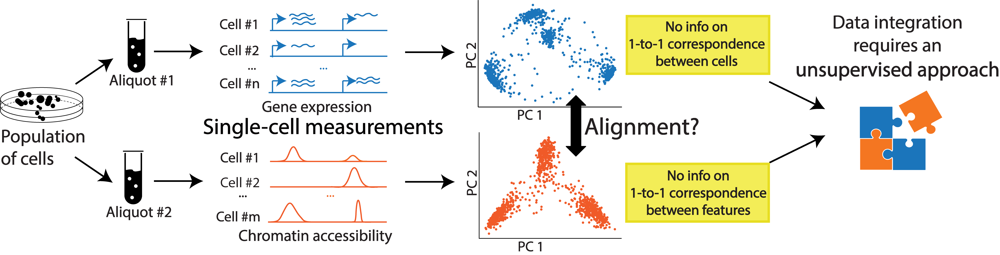
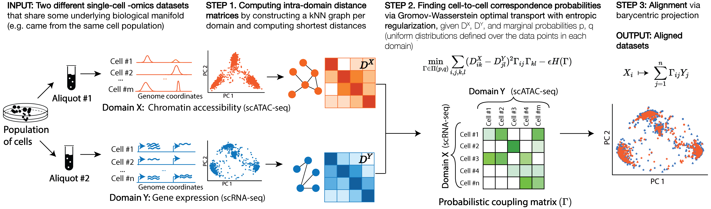

<!--  -->

### Welcome to the documentation page for SCOT!
**SCOT** is an **unsupervised algorithm** for performing cell-to-cell **alignment of single-cell multi-omic datasets**. <br>
We provide tutorials and examples on this website. For details on methodology and experimental results, please check out [our pre-print on bioRxiv](https://www.biorxiv.org/content/10.1101/2020.04.28.066787v2.full)

### Overview
Availability of various sequencing technologies allows us to capture different properties of the genome at the single-cell resolution and get a holistic view of the single-cell genome. **However, with very few exceptions of co-assaying technologies,applying different sequencing assays on the same single-cell is not possible.**<br>

In such situations, we can rely on **computational tools to align multi-omic data from separate but related datasets** (e.g. aliquots of the same population). As long as the measurements are expected to have some **shared underlying biological manifold** (e.g. taken from cell populations that contain the same cell types/states or share geneology), we expect to have sample-wise correspondence probabilities to recover across measurements and be able to align these datasets for an integrated view.<br>

This problem requires unsupervised computational methods because the process yields **disparate datasets:** Since we measure different properties of the genome on different cells, we have no 1-to-1 correspondence information between either the cells or the features. <br>


**SCOT** is an **unsupervised alignment tool** that yields correspondence probabilities between cells from different -omics datasets. Unlike many other integration methods, it runs **without requiring any correspondence information *a priori*** and aligns datasets based on the correspondence probabilities it recovers.

###### SCOT works in three steps:  

### Why should I prefer to use SCOT on my datasets?
While there are other alignment tools available, SCOT brings a few advantages that are important in real-world settings:<br>
######1. High quality multi-omic alignment
Most alignment methods are developed for batch integration of single-cell RNA-seq datasets (e.g. [scAlign](https://genomebiology.biomedcentral.com/articles/10.1186/s13059-019-1766-4), [MNN](https://pubmed.ncbi.nlm.nih.gov/29608177/), [Seurat](https://satijalab.org/seurat/archive/v3.1/immune_alignment.html), [Harmony](https://www.nature.com/articles/s41592-019-0619-0), [LIGER](https://www.nature.com/articles/s41596-020-0391-8)) and are [shown to perform poorly on multi-omic alignment tasks](https://academic.oup.com/bioinformatics/article/36/Supplement_1/i48/5870490#206061395), which is fundamentally a different problem. **SCOT is specifically designed for and [tested on multi-omic integration tasks](https://www.biorxiv.org/content/10.1101/2020.04.28.066787v2).**<br>

######2. Unsupervised alignment
Many alignment tools (e.g. [MAGAN](http://proceedings.mlr.press/v80/amodio18a/amodio18a.pdf), [Seurat](https://satijalab.org/seurat/archive/v3.1/immune_alignment.html)) require anchor points or feature-wise correspondence information to perform alignment, which one does not likely to have upon sequencing separate cell populations. **SCOT is an unsupervised tool and does not require any correspondence information to be known *a priori* in order to perform alignment.**<br>

######3. Approximately self-tuning hyperparameters
Other currently available unsupervised multi-omic alignment tools ([UnionCom](https://academic.oup.com/bioinformatics/article/36/Supplement_1/i48/5870490), [MMD-MA](https://jieliu6.github.io/files/mmd-ma.pdf), [Pamona](https://www.biorxiv.org/content/10.1101/2020.11.03.366146v1)) require users to perform hyperparameter optimization in order to yield high quality alignments. Without any validation data on correspondences, it is difficult to perform hyperparameter tuning. **SCOT provides [a procedure to approximately self-tune hyperparameters in fully unsupervised settings](https://rsinghlab.github.io/SCOT/unsupervised/).** <br>

######4. Handling cell type imbalance
Through an extension with unbalanced optimal transport, **SCOT is able to [handle cell type imbalance between multi-omic assays](https://rsinghlab.github.io/SCOT/unbalanced).**<br>

######5. Computational scalability
 In comparison to the other unsupervised mutli-omic alignment tools, **SCOT is [computationally scalable to large datasets](https://www.biorxiv.org/content/10.1101/2020.04.28.066787v2.full.pdf).**<br>

#### Contact and Citation
If you would like to use SCOT for your datasets, take a look at [the tutorial page](rsinghlab.github.io/SCOT/tutorial), as well as [the examples]() we provide on this documentation site. If you are having trouble getting started or have questions about SCOT, please do not hesitate to [**contact us**](rsinghlab.github.io/SCOT/contact)!<br>
If you use SCOT for your work, you can cite our pre-print as below:<br>

**BibTex Citation:**  
```
@article {SCOT2020,  
	author = {Demetci, Pinar and Santorella, Rebecca and Sandstede, Bj{\"o}rn and Noble, William Stafford and Singh, Ritambhara},  
	title = {Gromov-Wasserstein optimal transport to align single-cell multi-omics data},  
	elocation-id = {2020.04.28.066787},  
	year = {2020},  
	doi = {10.1101/2020.04.28.066787},  
	publisher = {Cold Spring Harbor Laboratory},  
	URL = {https://www.biorxiv.org/content/early/2020/11/11/2020.04.28.066787},  
	eprint = {https://www.biorxiv.org/content/early/2020/11/11/2020.04.28.066787.full.pdf},  
	journal = {bioRxiv}. 
}
```


